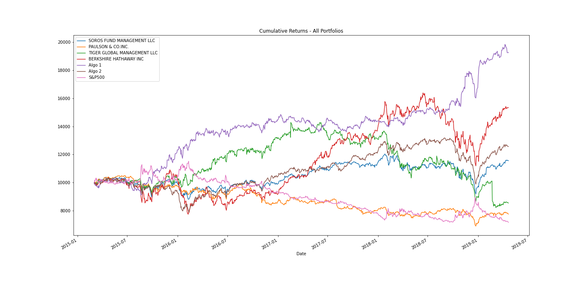

# pandas-portfolio-analysis

This project involved comparing investment returns from a couple of algorithmic trading strategies to investment returns from a few high profile investment firms such as Berkshire Hathaway, Soros Fund Management, and Paulson & Co.  

The three main tasks were to:

- Read In and Wrangle the Returns Data
- Perform Quantitative Analysis
- Choose and Evaluate a Custom Portfolio

**Reading and Wrangling**

I first used Pandas to read and clean several CSV files for analysis.  The CSV files include whale portfolio returns, algorithmic trading portfolio returns, and S&P 500 historical prices.  

I then detected and removed null values, removed dollar signs and converted data types as needed.  

The whale portfolios and algorithmic portfolio CSV files contained daily returns, but the S&P 500 CSV file contained closing prices so I converted the S&P 500 closing prices to daily returns.  

Finally I joined all CSV files into a single DataFrame with columns for each portfolio's returns.

**Quantitative Analysis**

I analyzed the data to see if any of the portfolios outperform the stock market (i.e., the S&P 500).

-**Performance Analysis**

- I calculated and plotted daily returns and cumulative returns of all portfolios

-**Risk Analysis**

- I created a box plot for each of the returns
- I calculated the standard deviation for each portfolio
- I determined which portfolios are riskier than the S&P 500
- I calculated the Annualized Standard Deviation

-**Rolling Statistics**

- I calculated and plotted the rolling standard deviation for all portfolios using a 21 day window
- I calculated and plotted the correlation between each stock to determine which portfolios may mimick the S&P 500
- I chose one portfolio to calculate and plot the 30 day rolling beta between it and the S&P 500

**Sharpe Ratios**

- I used the daily returns to calculate and visualize the Sharpe ratios using a bar plot
- Analyzing the results I was able to determine which strategies outperformed

